# Library Management System - Database Schema Documentation

## Overview

The Library Management System is a comprehensive RFID-enabled digital library solution designed for organizations and individual users. The system manages multiple library booths (kiosks) across various locations in Pune, India, with features including book tracking, subscription management, hardware inventory, and procurement.

## Database Structure

The database is organized into four logical schemas:

### 1. **Lms** (Library Management System)
Core business entities and transactional data

### 2. **Metadata**
Reference data and lookup tables

### 3. **Audit**
Audit logs and operational history

### 4. **Procurement**
Purchase order and inventory procurement management

---

## Schema Diagram

```mermaid
erDiagram
    %% Metadata Schema
    UserTypes ||--o{ Users : "defines"
    Language ||--o{ BookMaster : "written in"
    Genre ||--o{ BookMaster : "categorized by"
    BoothStatus ||--o{ BoothMaster : "has status"
    SubscriptionPlan ||--o{ Subscriptions : "subscribes to"
    SubscriptionDuration ||--o{ SubscriptionPlan : "duration"
    SubscriptionEventType ||--o{ Subscriptions : "current event"
    PurchaseOrderStatus ||--o{ PurchaseOrder : "has status"
    InventoryItemType ||--o{ Vendors : "supplies"
    InventoryItemType ||--o{ HardwareInventory : "item type"
    InventoryItemType ||--o{ PurchaseOrderItems : "item type"
    BookStatus ||--o{ BookOperationsLog : "resulting status"

    %% Lms Schema - Core Entities
    Author ||--o{ BookMaster : "writes"
    Publishers ||--o{ BookMaster : "publishes"
    BookMaster ||--o{ BookCopies : "physical copy of"
    BookMaster ||--o{ PurchaseOrderItems : "ordered"
    
    Organizations ||--o{ Users : "employs"
    Organizations ||--o{ BoothMaster : "hosts"
    Organizations ||--o{ Subscriptions : "org subscribers"
    
    Users ||--o{ PurchaseOrder : "orders (ordered_by)"
    Users ||--o{ PurchaseOrder : "receives (received_by)"
    
    BoothMaster ||--o{ BookCopies : "located at"
    BoothMaster ||--o{ HardwareInventory : "installed at"
    
    Vendors ||--o{ RFIDTagStock : "supplies"
    Vendors ||--o{ HardwareInventory : "supplies"
    Vendors ||--o{ PurchaseOrder : "sells to"
    
    RFIDTagStock ||--o| BookCopies : "tagged with"
    
    %% Procurement Schema
    PurchaseOrder ||--o{ PurchaseOrderItems : "contains"

    %% Entity Definitions
    
    Users {
        int User_id PK
        uniqueidentifier User_guid "default NEWID()"
        nvarchar username "unique"
        nvarchar password_hash "nullable"
        nvarchar first_name
        nvarchar middle_name
        nvarchar last_name
        nvarchar full_name "computed concat"
        nvarchar email "unique"
        nvarchar phone
        int user_type_id FK
        int organization_id FK "nullable"
        nvarchar govt_identifier_type
        nvarchar govt_identifier_id
        datetime2 created_date "default SYSUTCDATETIME()"
        bit is_active "default 1"
    }
    
    Organizations {
        int Organization_id PK
        uniqueidentifier Organization_code "default NEWID() unique"
        nvarchar Organization_name
        nvarchar contact_email
        nvarchar contact_phone
        nvarchar address
    }
    
    BookMaster {
        int Book_id PK
        nvarchar isbn "unique"
        nvarchar title
        int author_id FK "nullable"
        int publisher_id FK "nullable"
        int genre_id FK "nullable"
        int language_id FK "nullable"
        int publication_year
        nvarchar summary
        nvarchar cover_image_url
        int total_copies_owned "default 0"
        int copies_available_now "default 0"
    }
    
    BookCopies {
        int BookCopy_id PK
        int book_id FK
        int rfid_tag_stock_id FK "unique"
        int current_booth_id FK "nullable"
        date acquisition_date
    }
    
    BoothMaster {
        int Booth_id PK
        uniqueidentifier Booth_code "default NEWID() unique"
        nvarchar Booth_name
        nvarchar location_name
        decimal latitude
        decimal longitude
        int booth_status_id FK
        int total_book_capacity "default 100"
        int current_book_count "default 0"
        int organization_id FK "nullable"
        date last_maintenance_date
        date installed_date
    }
    
    HardwareInventory {
        int HardwareInventory_id PK
        nvarchar serial_number "unique"
        int inventory_item_type_id FK
        int vendor_id FK "nullable"
        nvarchar model
        date purchase_date
        date warranty_expiry_date
        date installation_date
        int installed_at_booth_id FK "nullable"
        date last_maintenance_date
        nvarchar firmware_version
        nvarchar condition
    }
    
    RFIDTagStock {
        int RFIDTagStock_id PK
        nvarchar rfid_tag "unique"
        int vendor_id FK "nullable"
        date purchase_date
        bit is_assigned "default 0"
        datetime2 assigned_date
        nvarchar assigned_to_entity_type
        int assigned_to_entity_id
    }
    
    Subscriptions {
        int Subscription_id PK
        int subscription_plan_id FK
        nvarchar subscriber_type "organization/user"
        int subscriber_id
        int subscription_event_type_id FK
        date start_date "default today"
        date end_date
        date renewal_date
        bit is_auto_renew "default 1"
        datetime2 created_date "default SYSUTCDATETIME()"
        datetime2 last_modified_date "default SYSUTCDATETIME()"
    }
    
    SubscriptionPlan {
        int SubscriptionPlan_id PK
        nvarchar SubscriptionPlan_name
        nvarchar subscription_level "organization/user"
        nvarchar description
        int max_users_allowed
        int max_books_per_user
        decimal subscription_cost
        int subscription_duration_id FK
        bit is_active "default 1"
    }
    
    Vendors {
        int Vendor_id PK
        nvarchar Vendor_name "unique"
        int inventory_item_type_id FK "nullable"
        nvarchar contact_person
        nvarchar contact_email
        nvarchar contact_phone
        nvarchar address
        nvarchar website
        bit is_active "default 1"
    }
    
    PurchaseOrder {
        int PurchaseOrder_id PK
        nvarchar po_number "unique"
        int vendor_id FK
        date order_date "default today"
        date expected_delivery_date
        date actual_delivery_date
        decimal total_amount "default 0"
        nvarchar currency "default INR"
        int po_status_id FK "default 1"
        int ordered_by_user_id FK "nullable"
        int received_by_user_id FK "nullable"
        nvarchar notes
        datetime2 created_date "default SYSUTCDATETIME()"
    }
    
    PurchaseOrderItems {
        int PurchaseOrderItem_id PK
        int purchase_order_id FK
        int inventory_item_type_id FK
        int book_id FK "nullable"
        nvarchar item_description
        int quantity
        decimal unit_price
        decimal line_total "computed"
        int quantity_received "default 0"
        nvarchar notes
    }
    
    Author {
        int Author_id PK
        nvarchar Author_name
        nvarchar pen_name
        nvarchar biography
        nvarchar nationality
        int birth_year
        nvarchar photo_url
    }
    
    Publishers {
        int Publisher_id PK
        nvarchar Publisher_name
        nvarchar contact_email
        nvarchar contact_phone
        nvarchar address
        nvarchar website
        bit is_active "default 1"
    }
    
    UserTypes {
        int UserTypes_id PK
        nvarchar UserTypes_name
    }
    
    Language {
        int Language_id PK
        nvarchar Language_name
        nvarchar language_code
    }
    
    Genre {
        int Genre_id PK
        nvarchar Genre_name
        nvarchar Genre_description
        nvarchar Genre_icon
    }
    
    BookStatus {
        int BookStatus_id PK
        nvarchar BookStatus_name
    }
    
    BoothStatus {
        int BoothStatus_id PK
        nvarchar BoothStatus_name
    }
    
    SubscriptionDuration {
        int SubscriptionDuration_id PK
        nvarchar SubscriptionDuration_name
        int duration_days
    }
    
    SubscriptionEventType {
        int SubscriptionEventType_id PK
        nvarchar SubscriptionEventType_name
    }
    
    PurchaseOrderStatus {
        int PurchaseOrderStatus_id PK
        nvarchar PurchaseOrderStatus_name
    }
    
    InventoryItemType {
        int InventoryItemType_id PK
        nvarchar InventoryItemType_name
    }
    
    BookOperationsLog {
        int Operation_id PK
        int book_copy_id FK
        int booth_id FK
        int user_id FK "nullable"
        nvarchar operation_type
        datetime2 operation_date "default SYSUTCDATETIME()"
        date due_date
        int book_status_id FK
        nvarchar notes
    }

    BoothAccessLog {
        int AccessLog_id PK
        int user_id FK "nullable"
        int booth_id FK
        datetime2 entry_time "default SYSUTCDATETIME()"
        datetime2 exit_time
        bit access_granted "default 1"
        nvarchar denial_reason
        decimal gps_latitude
        decimal gps_longitude
        datetime2 created_date "default SYSUTCDATETIME()"
    }

    SubscriptionOperationsLog {
        int SubscriptionOperationsLog_id PK
        int subscription_id FK
        int event_type_id FK
        datetime2 event_date "default SYSUTCDATETIME()"
        date effective_date
        int subscription_plan_id FK "nullable"
        date end_date
        int changed_by_user_id FK "nullable"
        decimal payment_amount
        nvarchar payment_reference
        nvarchar reason
        nvarchar notes
    }
```



---

## Table Descriptions

### Lms Schema Tables

#### Core Business Entities

| Table | Purpose | Key Relationships |
|-------|---------|-------------------|
| **Users** | System users including admins, operators, and patrons; computed `full_name`, unique `username`/`email` | FK to Metadata.UserTypes; optional FK to Lms.Organizations; creates/receives PurchaseOrders |
| **Organizations** | Organizations using the platform | Hosts Users and BoothMaster; can subscribe via polymorphic Subscriptions |
| **BookMaster** | Book catalog with ISBN, cover image, and copy counts | FK to Author, Publishers, Metadata.Genre, Metadata.Language; aggregates BookCopies |
| **BookCopies** | RFID-tagged physical book copies with current booth | FK to BookMaster, RFIDTagStock (unique), BoothMaster (nullable); status tracked via Audit.BookOperationsLog |
| **BoothMaster** | Library booths/kiosks with capacity and status | FK to Metadata.BoothStatus; optional FK to Organizations; hosts BookCopies and HardwareInventory |
| **HardwareInventory** | Booth hardware assets (readers, locks, kiosks) | FK to Metadata.InventoryItemType; optional FK to Vendors and BoothMaster (installed_at_booth_id) |
| **RFIDTagStock** | RFID tag inventory with assignment metadata | Optional FK to Vendors; unique `rfid_tag`; used by BookCopies; polymorphic assigned_to fields |
| **Subscriptions** | Subscriptions for orgs/users with end/renewal dates | FK to Metadata.SubscriptionPlan and SubscriptionEventType; subscriber_id/type polymorphic (no FK) |
| **Author** | Authors with optional pen name, bio, photo | Referenced by BookMaster |
| **Publishers** | Publishers with active flag | Referenced by BookMaster |
| **Vendors** | Suppliers for books/hardware | Optional FK to Metadata.InventoryItemType; supplies RFIDTagStock, HardwareInventory, PurchaseOrder |

### Metadata Schema Tables

| Table | Purpose | Values |
|-------|---------|--------|
| **UserTypes** | User role types | Admin, Operator, User |
| **Language** | Book languages | 23 Indian languages (Hindi, English, Marathi, Bengali, etc.) |
| **Genre** | Book genres | Fiction, Non-fiction, Biography, etc. |
| **BookStatus** | Book status values used in circulation events | Available, Borrowed, In Transit, Damaged, Lost, etc. |
| **BoothStatus** | Booth operational status | Active, Inactive, Maintenance, Offline |
| **SubscriptionPlan** | Reference plans with limits and costs | Basic, Standard, Premium, Enterprise (Org); Free, Basic, Premium, Family (User) |
| **SubscriptionDuration** | Subscription duration options | Monthly, Quarterly, Half-yearly, Yearly |
| **SubscriptionEventType** | Subscription lifecycle events | Active, Pending, Created, Renewed, Cancelled, Suspended, Expired, etc. |
| **PurchaseOrderStatus** | PO lifecycle status | Draft, Approved, Ordered, Partially Received, Received, Cancelled, Closed |
| **InventoryItemType** | Types of inventory items | Book, RFID Reader, EM Lock, Tablet Kiosk, Camera, Sensor, RFID Tag |

### Audit Schema Tables

| Table | Purpose |
|-------|---------|
| **BookOperationsLog** | Circulation audit (operation_type, due_date, resulting BookStatus) |
| **BoothAccessLog** | Entry/exit audit with access_granted, GPS, timestamps |
| **SubscriptionOperationsLog** | Subscription lifecycle events, plan changes, payments |

### Procurement Schema Tables

| Table | Purpose | Key Relationships |
|-------|---------|-------------------|
| **PurchaseOrder** | Purchase orders for procuring inventory | References Vendors, PurchaseOrderStatus, Users (ordered_by, received_by) |
| **PurchaseOrderItems** | Line items for purchase orders | References PurchaseOrder, InventoryItemType, BookMaster |

---

## Key Relationships Explained

### 1. **User Management**
- Users belong to UserTypes (Admin, Operator, User)
- Users may be affiliated with Organizations or be individual subscribers (organization_id is nullable)
- Users have government identifiers (Aadhar, PAN, Passport)

### 2. **Book Management**
- BookMaster contains catalog information (title, ISBN, author, publisher, genre, language)
- BookCopies are physical instances of books with unique RFID tags
- Each BookCopy can be assigned to a BoothMaster location (nullable current_booth_id supports in-transit state)
- BookStatuses are recorded per operation in Audit.BookOperationsLog, not stored on BookCopies

### 3. **RFID Tracking**
- RFIDTagStock maintains inventory of RFID tags
- Tags can be assigned or unassigned
- Uses polymorphic relationship: assigned_to_entity_type ('BookCopy') and assigned_to_entity_id
- Each BookCopy must have a unique RFID tag for tracking

### 4. **Booth/Location Management**
- BoothMaster represents physical library kiosks
- Each booth is hosted by an Organization
- Booths contain HardwareInventory (RFID readers, tablets, locks, cameras, sensors)
- BookCopies are distributed across booths based on location
- GPS coordinates track booth locations

### 5. **Subscription System**
- Polymorphic design: subscriber_type ('organization' or 'user')
- Organizations subscribe to organization-level plans (Basic, Standard, Premium, Enterprise)
- Individual users subscribe to user-level plans (Basic, Premium, Family)
- Subscriptions have lifecycle events (active, expired, renewed, cancelled, etc.) logged in Audit.SubscriptionOperationsLog
- subscriber_id is not constrained by FK; enforced through subscriber_type + application logic

### 6. **Procurement Process**
- PurchaseOrders are created by admin/operator users
- Each PO references a Vendor and has a status (draft, ordered, received, etc.)
- PurchaseOrderItems specify line items (books, hardware, RFID tags)
- For book purchases, book_id links to BookMaster
- Tracks quantity ordered vs quantity received

### 7. **Hardware Inventory**
- HardwareInventory tracks physical equipment at booths
- Equipment types: RFID Readers, Tablets, EM Locks, Cameras, Sensors
- Each item references Metadata.InventoryItemType; optional Vendor and installed_at_booth_id
- Condition and maintenance dates track equipment health

---

## Business Rules

### RFID Tag Assignment
- Each BookCopy must have exactly one RFID tag
- RFID tags are stored as NVARCHAR(128); typical encoding is EPC 96-bit (24 hex characters)
- Tags can only be assigned to one entity at a time
- Unassigned tags are available for new book acquisitions

### Subscription Management
- Organizations can have one active subscription at a time
- Individual users can have multiple subscriptions (different periods)
- Free plans are yearly with no auto-renewal
- Paid plans support monthly/quarterly/yearly durations with auto-renewal

### Booth Capacity
- Each booth tracks total_book_capacity and current_book_count
- Books can be "In Transit" between booths (current_booth_id is nullable)
- Booths under maintenance may have zero current_book_count

### Procurement Workflow
1. **Draft** - PO created but not approved
2. **Approved** - PO approved, ready to order
3. **Ordered** - PO sent to vendor
4. **Partially Received** - Some items received
5. **Received** - All items received
6. **Closed** - PO completed and closed
7. **Cancelled** - PO cancelled

### User Access Levels
- **Admin** - Full system access, can create POs, manage all entities
- **Operator** - Booth operations, receive POs, manage local inventory
- **User** - Library patrons, borrow/return books

---

## Technology Stack

- **Database**: Microsoft SQL Server
- **Currency**: INR (Indian Rupees)
- **RFID Standard**: EPC 96-bit (UHF 860-960MHz)
- **Identifier Standards**: 
  - Aadhar (12-digit)
  - PAN (10-character alphanumeric)
  - Passport (8-character)
- **Data Types**: IDENTITY for PKs, UNIQUEIDENTIFIER for codes, NVARCHAR for text, DECIMAL for currency

---

## Setup Instructions

1. **Create Schemas**
   ```sql
   CREATE SCHEMA Lms;
   CREATE SCHEMA Metadata;
   CREATE SCHEMA Audit;
   CREATE SCHEMA Procurement;
   ```

2. **Execute Schema Files** (in order)
    - Execute all files in `DBsection/schema/Metadata/` first (reference tables)
    - Execute all files in `DBsection/schema/Lms/` (core entities)
    - Execute all files in `DBsection/schema/Audit/` (audit tables)
    - Execute all files in `DBsection/schema/Procurement/` (procurement tables)

3. **Load Reference Data**
    - Execute all metadata files in `DBsection/data/` (UserTypes, Language, Genre, etc.)

4. **Load Dummy Data** (in dependency order)
   - Author.sql
   - Publishers.sql
   - BookMaster.sql
   - Organizations.sql
   - Users.sql
   - Vendors.sql
   - RFIDTagStock.sql
   - BoothMaster.sql
   - HardwareInventory.sql
   - BookCopies.sql
   - Subscriptions.sql
   - PurchaseOrder.sql
   - PurchaseOrderItems.sql

---

## Future Enhancements

- **Transaction Tables**: BorrowingTransactions, ReturnTransactions, FinePayments
- **Reservation System**: BookReservations, WaitlistQueue
- **Notification System**: Alerts for due dates, new arrivals, holds available
- **Analytics**: Usage reports, popular books, booth utilization
- **Payment Integration**: Online payment gateway for subscriptions and fines
- **Mobile App Integration**: User mobile app for booking and tracking

---
